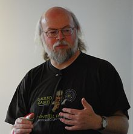
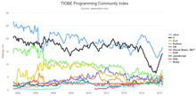

<strong>Java</strong>&nbsp;is a&nbsp;<a title="" href="https://en.wikipedia.org/wiki/General-purpose_language">general-purpose</a>&nbsp;<a title="Programming language" href="https://en.wikipedia.org/wiki/Programming_language">programming language</a>&nbsp;that is&nbsp;<a title="Class-based programming" href="https://en.wikipedia.org/wiki/Class-based_programming">class-based</a>,&nbsp;<a title="Object-oriented programming" href="https://en.wikipedia.org/wiki/Object-oriented_programming">object-oriented</a>, and designed to have as few implementation&nbsp;<a class="mw-redirect" title="Dependency (computer science)" href="https://en.wikipedia.org/wiki/Dependency_(computer_science)">dependencies</a>&nbsp;as possible. It is intended to let&nbsp;<a class="mw-redirect" title="Application developer" href="https://en.wikipedia.org/wiki/Application_developer">application developers</a>&nbsp;<em>write once, run anywhere</em>&nbsp;(WORA),&nbsp;meaning that&nbsp;<a title="Compiler" href="https://en.wikipedia.org/wiki/Compiler">compiled</a>&nbsp;Java code can run on all platforms that support Java without the need for recompilation.&nbsp;Java applications are typically compiled to&nbsp;<a title="Java bytecode" href="https://en.wikipedia.org/wiki/Java_bytecode">bytecode</a>&nbsp;that can run on any&nbsp;<a title="Java virtual machine" href="https://en.wikipedia.org/wiki/Java_virtual_machine">Java virtual machine</a>&nbsp;(JVM) regardless of the underlying&nbsp;<a title="Computer architecture" href="https://en.wikipedia.org/wiki/Computer_architecture">computer architecture</a>. The&nbsp;<a title="Syntax (programming languages)" href="https://en.wikipedia.org/wiki/Syntax_(programming_languages)">syntax</a>&nbsp;of&nbsp;<a title="Java (software platform)" href="https://en.wikipedia.org/wiki/Java_(software_platform)">Java</a>&nbsp;is similar to&nbsp;<a title="C (programming language)" href="https://en.wikipedia.org/wiki/C_(programming_language)">C</a>&nbsp;and&nbsp;<a title="C++" href="https://en.wikipedia.org/wiki/C%2B%2B">C++</a>, but it has fewer&nbsp;<a title="Low-level programming language" href="https://en.wikipedia.org/wiki/Low-level_programming_language">low-level</a>&nbsp;facilities than either of them. As of 2019, Java was one of the most&nbsp;<a title="Measuring programming language popularity" href="https://en.wikipedia.org/wiki/Measuring_programming_language_popularity">popular programming languages in use</a>&nbsp;according to&nbsp;<a title="GitHub" href="https://en.wikipedia.org/wiki/GitHub">GitHub</a>, particularly for&nbsp;<a class="mw-redirect" title="Client&ndash;server" href="https://en.wikipedia.org/wiki/Client%E2%80%93server">client-server</a>&nbsp;<a class="mw-redirect" title="Web applications" href="https://en.wikipedia.org/wiki/Web_applications">web applications</a>, with a reported 9 million developers.

Java was originally developed by&nbsp;<a title="James Gosling" href="https://en.wikipedia.org/wiki/James_Gosling">James Gosling</a>&nbsp;at&nbsp;<a title="Sun Microsystems" href="https://en.wikipedia.org/wiki/Sun_Microsystems">Sun Microsystems</a>&nbsp;(<a title="Sun acquisition by Oracle" href="https://en.wikipedia.org/wiki/Sun_acquisition_by_Oracle">which has since been acquired by Oracle</a>) and released in 1995 as a core component of Sun Microsystems'&nbsp;<a title="Java (software platform)" href="https://en.wikipedia.org/wiki/Java_(software_platform)">Java platform</a>. The original and&nbsp;<a title="Reference implementation" href="https://en.wikipedia.org/wiki/Reference_implementation">reference implementation</a>&nbsp;Java&nbsp;<a title="Compiler" href="https://en.wikipedia.org/wiki/Compiler">compilers</a>, virtual machines, and&nbsp;<a title="Library (computing)" href="https://en.wikipedia.org/wiki/Library_(computing)">class libraries</a>&nbsp;were originally released by Sun under&nbsp;<a class="mw-redirect" title="Proprietary license" href="https://en.wikipedia.org/wiki/Proprietary_license">proprietary licenses</a>. As of May 2007, in compliance with the specifications of the&nbsp;<a title="Java Community Process" href="https://en.wikipedia.org/wiki/Java_Community_Process">Java Community Process</a>, Sun had&nbsp;<a title="Software relicensing" href="https://en.wikipedia.org/wiki/Software_relicensing">relicensed</a>&nbsp;most of its Java technologies under the&nbsp;<a title="GNU General Public License" href="https://en.wikipedia.org/wiki/GNU_General_Public_License">GNU General Public License</a>. Meanwhile, others have developed alternative implementations of these Sun technologies, such as the&nbsp;<a title="GNU Compiler for Java" href="https://en.wikipedia.org/wiki/GNU_Compiler_for_Java">GNU Compiler for Java</a>&nbsp;(bytecode compiler),&nbsp;<a title="GNU Classpath" href="https://en.wikipedia.org/wiki/GNU_Classpath">GNU Classpath</a>&nbsp;(standard libraries), and&nbsp;<a title="IcedTea" href="https://en.wikipedia.org/wiki/IcedTea">IcedTea</a>-Web (browser plugin for applets).

The latest versions are&nbsp;<a title="Java version history" href="https://en.wikipedia.org/wiki/Java_version_history">Java&nbsp;13</a>, released in September 2019, and Java&nbsp;11, a currently supported&nbsp;<a title="Long-term support" href="https://en.wikipedia.org/wiki/Long-term_support">long-term support</a>&nbsp;(LTS) version, released on September 25, 2018;&nbsp;<a title="Oracle Corporation" href="https://en.wikipedia.org/wiki/Oracle_Corporation">Oracle</a>&nbsp;released for the&nbsp;<a title="Legacy system" href="https://en.wikipedia.org/wiki/Legacy_system">legacy</a>&nbsp;Java&nbsp;8&nbsp;LTS the last free public update in January 2019 for commercial use, while it will otherwise still support Java&nbsp;8 with public updates for personal use up to at least December 2020. Oracle (and others) highly recommend uninstalling older versions of Java because of serious risks due to unresolved security issues.&nbsp;Since Java&nbsp;9 (and 10 and 12) is no longer supported, Oracle advises its users to immediately transition to the latest version (currently Java 13) or an LTS release.

 

<h2>History</h2>

&nbsp;

&nbsp;

<a title="James Gosling" href="https://en.wikipedia.org/wiki/James_Gosling">James Gosling</a>, the creator of Java, in 2008

&nbsp;

&nbsp;

The&nbsp;<a title="TIOBE index" href="https://en.wikipedia.org/wiki/TIOBE_index">TIOBE</a>&nbsp;<a title="Measuring programming language popularity" href="https://en.wikipedia.org/wiki/Measuring_programming_language_popularity">programming language popularity index</a>&nbsp;graph from 2002 to 2018. Java is steadily on the top since mid-2015.

<a title="James Gosling" href="https://en.wikipedia.org/wiki/James_Gosling">James Gosling</a>, Mike Sheridan, and&nbsp;<a title="Patrick Naughton" href="https://en.wikipedia.org/wiki/Patrick_Naughton">Patrick Naughton</a>&nbsp;initiated the Java language project in June 1991.&nbsp;Java was originally designed for interactive television, but it was too advanced for the digital cable television industry at the time.<a href="https://en.wikipedia.org/wiki/Java_(programming_language)#cite_note-22">[22]</a>&nbsp;The language was initially called&nbsp;<em><a title="Oak (programming language)" href="https://en.wikipedia.org/wiki/Oak_(programming_language)">Oak</a></em>&nbsp;after an&nbsp;<a title="Oak" href="https://en.wikipedia.org/wiki/Oak">oak</a>&nbsp;tree that stood outside Gosling's office. Later the project went by the name&nbsp;<em>Green</em>&nbsp;and was finally renamed&nbsp;<em>Java</em>, from&nbsp;<a class="mw-redirect" title="Java coffee" href="https://en.wikipedia.org/wiki/Java_coffee">Java coffee</a>, the coffee from&nbsp;<a title="Indonesia" href="https://en.wikipedia.org/wiki/Indonesia">Indonesia</a>.&nbsp;Gosling designed Java with a&nbsp;<a title="C (programming language)" href="https://en.wikipedia.org/wiki/C_(programming_language)">C</a>/<a title="C++" href="https://en.wikipedia.org/wiki/C%2B%2B">C++</a>-style syntax that system and application programmers would find familiar.

Sun Microsystems released the first public implementation as Java&nbsp;1.0 in 1996.&nbsp;It promised&nbsp;<strong>Write Once, Run Anywhere</strong>&nbsp;(WORA) functionality, providing no-cost run-times on popular&nbsp;<a title="Computing platform" href="https://en.wikipedia.org/wiki/Computing_platform">platforms</a>. Fairly secure and featuring configurable security, it allowed network- and file-access restrictions. Major&nbsp;<a title="Web browser" href="https://en.wikipedia.org/wiki/Web_browser">web browsers</a>&nbsp;soon incorporated the ability to run&nbsp;<a title="Java applet" href="https://en.wikipedia.org/wiki/Java_applet">Java applets</a>&nbsp;within web pages, and Java quickly became popular. The Java&nbsp;1.0 compiler was re-written&nbsp;<a title="Bootstrapping (compilers)" href="https://en.wikipedia.org/wiki/Bootstrapping_(compilers)">in Java</a>&nbsp;by&nbsp;<a title="Arthur van Hoff" href="https://en.wikipedia.org/wiki/Arthur_van_Hoff">Arthur van Hoff</a>&nbsp;to comply strictly with the Java&nbsp;1.0 language specification.&nbsp;With the advent of Java&nbsp;2 (released initially as J2SE&nbsp;1.2 in December 1998&nbsp;&ndash; 1999), new versions had multiple configurations built for different types of platforms. J2EE included technologies and APIs for enterprise applications typically run in server environments, while J2ME featured APIs optimized for mobile applications. The desktop version was renamed J2SE. In 2006, for marketing purposes, Sun renamed new J2 versions as&nbsp;<em><a title="Java Platform, Enterprise Edition" href="https://en.wikipedia.org/wiki/Java_Platform,_Enterprise_Edition">Java EE</a></em>,&nbsp;<em><a title="Java Platform, Micro Edition" href="https://en.wikipedia.org/wiki/Java_Platform,_Micro_Edition">Java ME</a></em>, and&nbsp;<em><a title="Java Platform, Standard Edition" href="https://en.wikipedia.org/wiki/Java_Platform,_Standard_Edition">Java SE</a></em>, respectively.

In 1997, Sun Microsystems approached the&nbsp;<a title="ISO/IEC JTC 1" href="https://en.wikipedia.org/wiki/ISO/IEC_JTC_1">ISO/IEC JTC 1</a>&nbsp;standards body and later the&nbsp;<a title="Ecma International" href="https://en.wikipedia.org/wiki/Ecma_International">Ecma International</a>&nbsp;to formalize Java, but it soon withdrew from the process. Java remains a&nbsp;<a title="De facto standard" href="https://en.wikipedia.org/wiki/De_facto_standard"><em>de facto</em>&nbsp;standard</a>, controlled through the&nbsp;<a title="Java Community Process" href="https://en.wikipedia.org/wiki/Java_Community_Process">Java Community Process</a>.<a href="https://en.wikipedia.org/wiki/Java_(programming_language)#cite_note-30">[30]</a>&nbsp;At one time, Sun made most of its Java implementations available without charge, despite their&nbsp;<a title="Proprietary software" href="https://en.wikipedia.org/wiki/Proprietary_software">proprietary software</a>&nbsp;status. Sun generated revenue from Java through the selling of licenses for specialized products such as the Java Enterprise System.

On November 13, 2006, Sun released much of its Java virtual machine (JVM) as&nbsp;<a title="Free and open-source software" href="https://en.wikipedia.org/wiki/Free_and_open-source_software">free and open-source software</a>&nbsp;(FOSS), under the terms of the&nbsp;<a title="GNU General Public License" href="https://en.wikipedia.org/wiki/GNU_General_Public_License">GNU General Public License</a>&nbsp;(GPL). On May 8, 2007, Sun finished the process, making all of its JVM's core code available under&nbsp;<a title="Free software" href="https://en.wikipedia.org/wiki/Free_software">free software</a>/open-source distribution terms, aside from a small portion of code to which Sun did not hold the copyright.

Sun's vice-president Rich Green said that Sun's ideal role with regard to Java was as an&nbsp;<em>evangelist</em>.&nbsp;Following&nbsp;<a title="Oracle Corporation" href="https://en.wikipedia.org/wiki/Oracle_Corporation">Oracle Corporation</a>'s acquisition of Sun Microsystems in 2009&ndash;10, Oracle has described itself as the steward of Java technology with a relentless commitment to fostering a community of participation and transparency.&nbsp;This did not prevent Oracle from filing a lawsuit against Google shortly after that for using Java inside the&nbsp;<a class="mw-redirect" title="Android SDK" href="https://en.wikipedia.org/wiki/Android_SDK">Android SDK</a>&nbsp;(see the&nbsp;<em><a href="https://en.wikipedia.org/wiki/Java_(programming_language)#Android">Android</a></em>&nbsp;section). Java software runs on everything from laptops to&nbsp;<a title="Data center" href="https://en.wikipedia.org/wiki/Data_center">data centers</a>,&nbsp;<a title="Video game console" href="https://en.wikipedia.org/wiki/Video_game_console">game consoles</a>&nbsp;to scientific&nbsp;<a title="Supercomputer" href="https://en.wikipedia.org/wiki/Supercomputer">supercomputers</a>.&nbsp;On April 2, 2010, James Gosling resigned from&nbsp;<a title="Oracle Corporation" href="https://en.wikipedia.org/wiki/Oracle_Corporation">Oracle</a>.

In January 2016, Oracle announced that Java run-time environments based on JDK 9 will discontinue the browser plugin.

<h3>Principles</h3>

There were five primary goals in the creation of the Java language:

<blockquote>
<ol>
<li>It must be simple, object-oriented, and familiar.</li>
<li>It must be robust and secure.</li>
<li>It must be architecture-neutral and portable.</li>
<li>It must execute with high performance.</li>
<li>It must be interpreted, threaded, and dynamic.</li>
</ol>
</blockquote>
<h3>Versions</h3>

&nbsp;

As of March&nbsp;2019, Java&nbsp;8 is supported; and both Java&nbsp;8 and 11 as Long Term Support (LTS) versions. Major release versions of Java, along with their release dates:

<ul>
<li>JDK 1.0 (January 23, 1996)</li>
<li>JDK 1.1 (February 19, 1996)</li>
<li>J2SE 1.2 (December 8, 1998)</li>
<li>J2SE 1.3 (May 8, 2000)</li>
<li>J2SE 1.4 (February 6, 2002)</li>
<li>J2SE 5.0 (September 30, 2004)</li>
<li>Java SE 6 (December 11, 2006)</li>
<li>Java SE 7 (July 28, 2011)</li>
<li>Java SE 8 (March 18, 2014)</li>
<li>Java SE 9 (September 21, 2017)</li>
<li>Java SE 10 (March 20, 2018)</li>
<li>Java SE 11 (September 25, 2018)</li>
<li>Java SE 12 (March 19, 2019)</li>
<li>Java SE 13 (September 17, 2019)</li>
</ul>

&nbsp;

<h2>Contents</h2>
<label class="toctogglelabel" for="toctogglecheckbox"></label>

<ul>
<li class="toclevel-1 tocsection-1"><a href="#History">History</a>
<ul>
<li class="toclevel-2 tocsection-2"><a href="#Principles">Principles</a></li>
<li class="toclevel-2 tocsection-3"><a href="#Versions">Versions</a></li>
</ul>
</li>
<li class="toclevel-1 tocsection-4"><a href="#Editions">Editions</a></li>
<li class="toclevel-1 tocsection-5"><a href="#Execution_system">Execution system</a>
<ul>
<li class="toclevel-2 tocsection-6"><a href="#Java_JVM_and_Bytecode">Java JVM and Bytecode</a>
<ul>
<li class="toclevel-3 tocsection-7"><a href="#Performance">Performance</a></li>
</ul>
</li>
<li class="toclevel-2 tocsection-8"><a href="#Non-JVM">Non-JVM</a></li>
<li class="toclevel-2 tocsection-9"><a href="#Automatic_memory_management">Automatic memory management</a></li>
</ul>
</li>
<li class="toclevel-1 tocsection-10"><a href="#Syntax">Syntax</a>
<ul>
<li class="toclevel-2 tocsection-11"><a href="#Hello_world_example">Hello world example</a></li>
<li class="toclevel-2 tocsection-12"><a href="#Example_with_methods">Example with methods</a></li>
</ul>
</li>
<li class="toclevel-1 tocsection-13"><a href="#Special_classes">5Special classes</a>
<ul>
<li class="toclevel-2 tocsection-14"><a href="#Applet">Applet</a></li>
<li class="toclevel-2 tocsection-15"><a href="#Servlet">Servlet</a></li>
<li class="toclevel-2 tocsection-16"><a href="#JavaServer_Pages">JavaServer Pages</a></li>
<li class="toclevel-2 tocsection-17"><a href="#Swing_application">Swing application</a></li>
<li class="toclevel-2 tocsection-18"><a href="#JavaFX_application">JavaFX application</a></li>
<li class="toclevel-2 tocsection-19"><a href="#Generics">Generics</a></li>
</ul>
</li>
<li class="toclevel-1 tocsection-20"><a href="#Criticism">Criticism</a></li>
<li class="toclevel-1 tocsection-21"><a href="#Class_libraries">Class libraries</a></li>
<li class="toclevel-1 tocsection-22"><a href="#Documentation">Documentation</a></li>
<li class="toclevel-1 tocsection-23"><a href="#Implementations">Implementations</a></li>
<li class="toclevel-1 tocsection-24"><a href="#Use_outside_the_Java_platform">Use outside the Java platform</a>
<ul>
<li class="toclevel-2 tocsection-25"><a href="#Android">Android</a>
<ul>
<li class="toclevel-3 tocsection-26"><a href="#Controversy">Controversy</a></li>
</ul>
</li>
</ul>
</li>
</ul>

 

<ul>
                                <li><b><a target="_blank" href="https://github.com/manjunath5496/Java-Programming-Books/blob/master/java(1).pdf" style="text-decoration:none;">Head First Java </a></b></li>
                                <li><b><a target="_blank" href="https://github.com/manjunath5496/Java-Programming-Books/blob/master/java(2).pdf" style="text-decoration:none;">Core Java, Volume II — Advanced Features</a></b></li>
                                <li><b><a target="_blank" href="https://github.com/manjunath5496/Java-Programming-Books/blob/master/java(3).pdf" style="text-decoration:none;">Fundamentals of the Java Programming Language, Java SE 6</a></b></li>
                               
<li><b><a target="_blank" href="https://github.com/manjunath5496/Java-Programming-Books/blob/master/java(4).pdf" style="text-decoration:none;">Fundamentals of Computer Science Using Java</a></b></li>
                                <li><b><a target="_blank" href="https://github.com/manjunath5496/Java-Programming-Books/blob/master/java(5).pdf" style="text-decoration:none;">Java 9 Programming By Example </a></b></li>
                                
 <li><b><a target="_blank" href="https://github.com/manjunath5496/Java-Programming-Books/blob/master/java(6).pdf" style="text-decoration:none;">Java for Absolute Beginners</a></b></li>
                          
<li><b><a target="_blank" href="https://github.com/manjunath5496/Java-Programming-Books/blob/master/java(7).pdf" style="text-decoration:none;">JAVA: A Beginner's Guide to Learning the Basics of Java Programming</a></b></li>
                                <li><b><a target="_blank" href="https://github.com/manjunath5496/Java-Programming-Books/blob/master/java(8).pdf" style="text-decoration:none;">JAVA: Easy Java Programming for Beginners, Your Step-
By-Step Guide to Learning Java Programming </a></b></li>
                                <li><b><a target="_blank" href="https://github.com/manjunath5496/Java-Programming-Books/blob/master/java(9).pdf" style="text-decoration:none;">Java For Beginners: A Simple Start To Java</a></b></li>
                                
<li><b><a target="_blank" href="https://github.com/manjunath5496/Java-Programming-Books/blob/master/java(10).pdf" style="text-decoration:none;">Java All-in-One For Dummies</a></b></li>  
        
<li><b><a target="_blank" href="https://github.com/manjunath5496/Java-Programming-Books/blob/master/java(11).pdf" style="text-decoration:none;">Java Programming Language Handbook </a></b></li>
                                <li><b><a target="_blank" href="https://github.com/manjunath5496/Java-Programming-Books/blob/master/java(12).pdf" style="text-decoration:none;">Java: The Complete Reference</a></b></li>
 <li><b><a target="_blank" href="https://github.com/manjunath5496/Java-Programming-Books/blob/master/java(13).pdf" style="text-decoration:none;">Learning Java Functional Programming</a></b></li>  
  <li><b><a target="_blank" href="https://github.com/manjunath5496/Java-Programming-Books/blob/master/java(14).pdf" style="text-decoration:none;">Modern Java in Action</a></b></li>  
 <li><b><a target="_blank" href="https://github.com/manjunath5496/Java-Programming-Books/blob/master/java(15).pdf" style="text-decoration:none;">The Well-Grounded Java Developer</a></b></li>
                                <li><b><a target="_blank" href="https://github.com/manjunath5496/Java-Programming-Books/blob/master/java(16).pdf" style="text-decoration:none;">Java in a Nutshell</a></b></li>

 <li><b><a target="_blank" href="https://github.com/manjunath5496/Java-Programming-Books/blob/master/java(17).pdf" style="text-decoration:none;">Java Generics and Collections</a></b></li>
                                <li><b><a target="_blank" href="https://github.com/manjunath5496/Java-Programming-Books/blob/master/java(18).pdf" style="text-decoration:none;">Spring in Action</a></b></li>

<li><b><a target="_blank" href="https://github.com/manjunath5496/Java-Programming-Books/blob/master/java(19).pdf" style="text-decoration:none;">Think Java: How to Think Like a Computer Scientist</a></b></li>

 <li><b><a target="_blank" href="https://github.com/manjunath5496/Java-Programming-Books/blob/master/java(20).pdf" style="text-decoration:none;">Thinking in Java</a></b></li>
                                <li><b><a target="_blank" href="https://github.com/manjunath5496/Java-Programming-Books/blob/master/java(21).pdf" style="text-decoration:none;">Spring Microservices in Action</a></b></li>

   <li><b><a target="_blank" href="https://github.com/manjunath5496/Java-Programming-Books/blob/master/java(22).pdf" style="text-decoration:none;">The Elements of Java Style</a></b></li>

 <li><b><a target="_blank" href="https://github.com/manjunath5496/Java-Programming-Books/blob/master/java(23).pdf" style="text-decoration:none;">Beginning Programming with Java For Dummies</a></b></li>
                                <li><b><a target="_blank" href="https://github.com/manjunath5496/Java-Programming-Books/blob/master/java(24).pdf" style="text-decoration:none;">Effective Java</a></b></li>

<li><b><a target="_blank" href="https://github.com/manjunath5496/Java-Programming-Books/blob/master/java(25).pdf" style="text-decoration:none;">Java For Dummies</a></b></li>

   <li><b><a target="_blank" href="https://github.com/manjunath5496/Java-Programming-Books/blob/master/java(26).pdf" style="text-decoration:none;">Java Network Programming</a></b></li>

 <li><b><a target="_blank" href="https://github.com/manjunath5496/Java-Programming-Books/blob/master/java(27).pdf" style="text-decoration:none;">Java Puzzlers: Traps, Pitfalls, and Corner Cases</a></b></li>
                                <li><b><a target="_blank" href="https://github.com/manjunath5496/Java-Programming-Books/blob/master/java(28).pdf" style="text-decoration:none;">Java SE 8 for the Really Impatient</a></b></li>

<li><b><a target="_blank" href="https://github.com/manjunath5496/Java-Programming-Books/blob/master/java(29).pdf" style="text-decoration:none;">Java Threads</a></b></li>

<li><b><a target="_blank" href="https://github.com/manjunath5496/Java-Programming-Books/blob/master/java(30).pdf" style="text-decoration:none;">The Java Virtual Machine Specification (Java SE 8 Edition)</a></b></li>

   <li><b><a target="_blank" href="https://github.com/manjunath5496/Java-Programming-Books/blob/master/java(31).pdf" style="text-decoration:none;">Murach's Beginning Java 2</a></b></li>

 <li><b><a target="_blank" href="https://github.com/manjunath5496/Java-Programming-Books/blob/master/java(32).pdf" style="text-decoration:none;">Java Performance: The Definitive Guide</a></b></li>
                                <li><b><a target="_blank" href="https://github.com/manjunath5496/Java-Programming-Books/blob/master/java(33).pdf" style="text-decoration:none;">Concurrent Programming in Java: Design Principles and Patterns</a></b></li>

<li><b><a target="_blank" href="https://github.com/manjunath5496/Java-Programming-Books/blob/master/java(34).pdf" style="text-decoration:none;">Java Concurrency In Practice </a></b></li>

   <li><b><a target="_blank" href="https://github.com/manjunath5496/Java-Programming-Books/blob/master/java(35).pdf" style="text-decoration:none;">High-Performance Java Persistence</a></b></li>

 <li><b><a target="_blank" href="https://github.com/manjunath5496/Java-Programming-Books/blob/master/java(36).pdf" style="text-decoration:none;">Java: How To Program</a></b></li>
                                <li><b><a target="_blank" href="https://github.com/manjunath5496/Java-Programming-Books/blob/master/java(37).pdf" style="text-decoration:none;">Teach Yourself JAVA in 21 Days</a></b></li>

<li><b><a target="_blank" href="https://github.com/manjunath5496/Java-Programming-Books/blob/master/java(38).pdf" style="text-decoration:none;">Java 8 Lambdas </a></b></li>

</ul>
